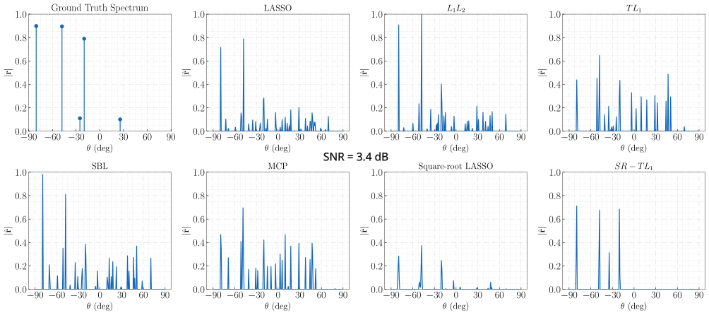
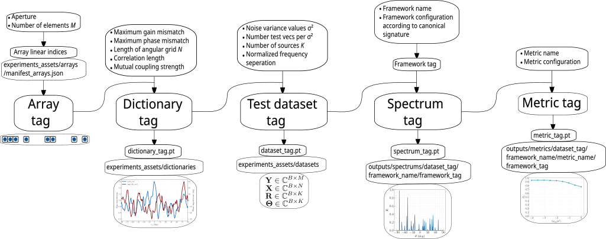

# SR-TL1: A Square-Root TL1-Norm Framework for Robust SMV DoA 

This repository supplements the [paper](https://arxiv.org/abs/2608.20943) "SR-TL1: A Square-Root TL1-Norm Framework for Robust SMV DoA Estimation under Highly-Coherent Dictionaries". SR-TL1 combines the noise-robust properties of the square-root LASSO framework with the TL1 norm, a non-convex penalty well-known for having strong recovery properties under highly-coherent dictionaries, which is typically the case for direction of arrival (DoA) estimation under a fine angular-grid. The proposed framework shows a competitive performance against other sota baselines (SBL, Square-root LASSO, TL1, L1-L2 norm, MCP) while having a computational complexity of at most $O(MN)$ per iteration, where $M$ is the array size and $N$ is the angular grid length. The sparse, high-resolution spectrum from SR-TL1 can be used along with outputs from other sensorial modalities for downstream tasks such as object detection and identification.




## Table of Contents

1. [Replicating the full experiments](#repository-setup)
2. [Step-by-step walkthrough](#step-by-step)
   - [Array generation](#array-gen)
   - [Dictionary generation](#dictionary-gen)
   - [Dataset generation](#dataset-gen)
   - [Frameworks evaluation](#framework-eval)


## Requirements

We first setup the repo and environment.

```sh
git clone https://github.com/youvalklioui/sr-tl1-doa.git
cd sr-tl1-doa

conda create --name srtl1_env python=3.10
conda activate srtl1_env_env
pip install -r requirements.txt
```
## Replicating the Full Experiments
To directly replicate all the results reported in the manuscript, simply run
```sh
python main.py run-full-experiment
```
This will create the sparse array, dictionary, dataset, evaluate the spectrums for every framework and every regularizer value, and conduct a performance characterization with the three metrics (Detection rate $P_{D}$, False alarm rate $P_{fa}$, and RMSE) for each spectrum. The results will be saved under `./outputs` and the provided `plots.ipynb` can be used to visualize the results. Below is a step-by-step walkthrough for more details.

## Step-by-step Walkthrough
Each object generated (array, dictionary, dataset, framework configuration, spectrum, metric configuration) is uniquely identified with an 8-character alphanumeric tag as shown bellow.  


### Array Generation
We create a sparse linear array (SLA) by either specifying the `aperture` (in $\lambda/2$ units) and the number of elements  `num_elements`:

```sh
python main.py create-array  --num_elements 30 --aperture 60 
```
or by directly entering the linear indices (in $\lambda/2$ units) of the array as a list of integers:
```sh
python main.py create-array [0, 7, 18, 20, 25, 28, 40, 54, 57, 60]
```

The array will be saved in `manifest_arrays.json`, under `experiments_assets/arrays` with a unique `array_tag`.

### Dictionary Generation
 Given an array, a dictionary can then be synthesized by specifying the maximum gain and phase range for the angular-dependent mismatch coefficients $\mathbf{\Psi}(\theta,m)$, the correlation length, along with the average and relative variation of the mutual coupling coefficients $\mathbf{\Gamma}$. See section 6.2.1 and 6.2.2 of the manuscript for additional details on these coefficients. For generating the dictionary we run

```sh
python main.py create-dictionary \
  --array_tag '2T3nFgKx' \
  --dictionary_length 256 \
  --correlation_length 5 \
  --max_gain_deviation 0.3 \
  --max_phase_deviation 30 \
  --average_mutual_coupling 0.1 \
  --relative_variation_coupling 0.1
```

This will create a phase-gain imperfection profile where the gain mismatch for any element of the array $|\mathbf{\Psi}(\theta,m)|$ will vary between $0.7$ and $1.3$, the angular mismatch  $\textrm{arg}(\mathbf{\Psi}(\theta,m))$ will vary between $-30^{\circ}$ and $30^{\circ}$. The mismatch coefficients $\mathbf{\Psi}(\theta_{1},m)$ and $\mathbf{\Psi}(\theta_{2},m)$ between any two angles $\theta_{1}, \theta_{2}$ will be strongly correlated when $|\theta_{1}-\theta_{2}|<5^{\circ}$. The mutual coupling strength between the array element $m$ and $m+1$ is given by $|\Gamma(m,m+1)|$ and it will have an average value of $0.1$ with a relative variation of approximately $0.1$ around the mean. 

The dictionary will have a unique tag corresponding to the configuration specified (which includes the specific array tag used), and will be saved as a `dictionary_tag.pt` file under `experiments_assets/dictionaries`. The configuration and the dictionary path will additionally be logged in `manifest_dictionaries.json` and `paths_dictionaries.json` with the same dictionary tag under the same directory.
### Dataset Generation
With the dictionary created, we can generate a test dataset using

```sh
python main.py create-dataset \
  --dictionary_tag 'bC1h4LnB' \
  --log_noise_variance_values [-4, -3, -1.5, 0] \
  --num_vectors_per_variance 1000 \
  --number_sources 10 \
  --min_freq_separation_factor 3 
```
For each noise variance level $\sigma^{2}_{l}$, which are given by $\sigma^{2}_{l}\in \{10^{-4}, 10^{-3}, 10^{-1.5}, 1\}$ for the example above, $1000$ noisy measurement vectors $\mathbf{y}$ will be generated with zero-mean Gaussian noise $\mathbf{n}\sim(\mathbf{0}, \sigma^{2}_{l}\mathbf{I})$ , and each measurement vector will have $K=10$ sources with a minimum normalized frequency separation between any two sources given by `1/(min_freq_separation_factor * num_elements)`.

The generated dataset will have a unique tag corresponding to the configuration used (including the specific dictionary tag), and will be saved as a `dataset_tag.pt` file under `experiments_assets/datasets`. The configuration and the dictionary path will additionally be logged in `manifest_datasets.json` and `paths_datasets.json` with the same dataset tag under the same directory.
### Framework Performance Evaluation
To evaluate the performance of a given framework (currently supported: `'LASSO', 'L1L2', 'TL1', 'MCP', 'square-root LASSO', 'SR-TL1', 'SBL'`) with respect to a given metric (currently supported: `'detection _rate', 'false_alarm_rate', 'rmse'`) we run
```sh
python main.py evaluate-framework 
  --framework 'LASSO' \
  --dataset_tag 'zH1sd6Lp' \
  --device 'cuda' \
  --regularization_parameter 0.3 \
  --iterations 1000 \
  --rho 1 \
  --metric 'false_alarm_rate'
  --amplitude_threshold 0.1 \
  --angular_bins_threshold 2 \
  --false_alarm_threshold 0.005
```
The command will first check whether a LASSO spectrum for that specific combination of dataset tag and framework configuration (see `default_configs.py` for a list of the kwargs required for each framework) already exists and load it. If not, the spectrum is first computed using the specified `device` and saved with a unique spectrum tag as a `spectrum_tag.pt` file  under `outputs/spectrums/dataset_tag/framework_label/framework_tag`, it is additionally logged in the `manifest_spectrums.json` and `paths_spectrums.json` under `outputs/spectrums` with that same spectrum tag. Here `framework_tag` is a tag generated from the specific configuration used with the framework excluding the dataset tag, whereas `spectrum_tag` itself is uniquely determined from both `dataset_tag` and `framework_tag`. Next, the false alarm rate $P_{fa}$ will be evaluated using the computed spectrum. Each metric has a specific set of required kwargs that can also be found in `default_configs.py`. In the above example, when evaluating the false alarm rate, a peak in the reconstructed spectrum is considered a successful recovery if and only if it is located within  `angular_bins_threshold * angular_grid_resolution`, where `angular_grid_resolution = 180 / dictionary_length`, from the ground truth angle and its amplitude is equal to least `amplitude_threshold` that of the ground truth amplitude. A peak is considered a false alarm if it does not correspond to any successful recovery and its amplitude is higher than `false_alarm_threshold`. See section 6.1 of the manuscript for more details on how each metric is defined. The resulting metric result is saved with a unique tag, resulting from the spectrum tag and the specific metric configuration used, as a `metric_tag.pt` under `outputs/metrics/dataset_tag/framework_label/metric_label/framework_tag`.  


